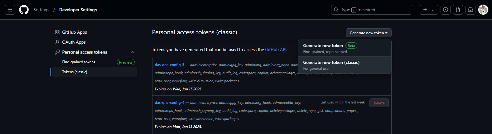
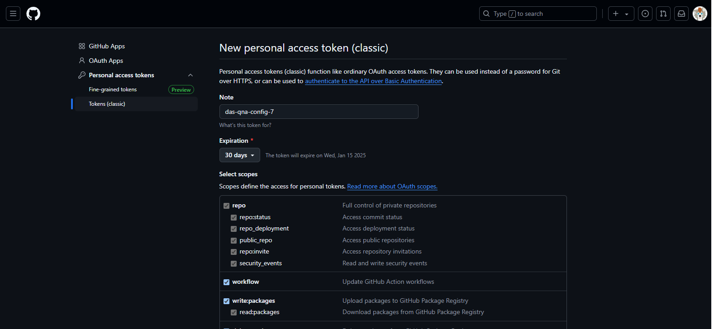
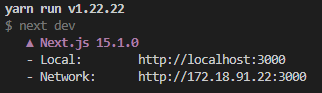
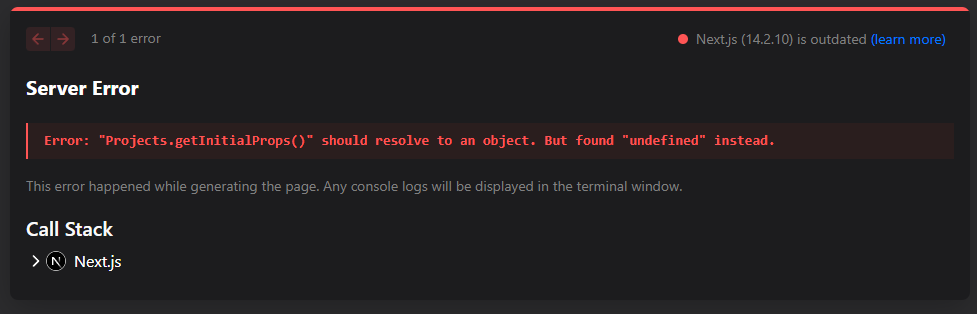
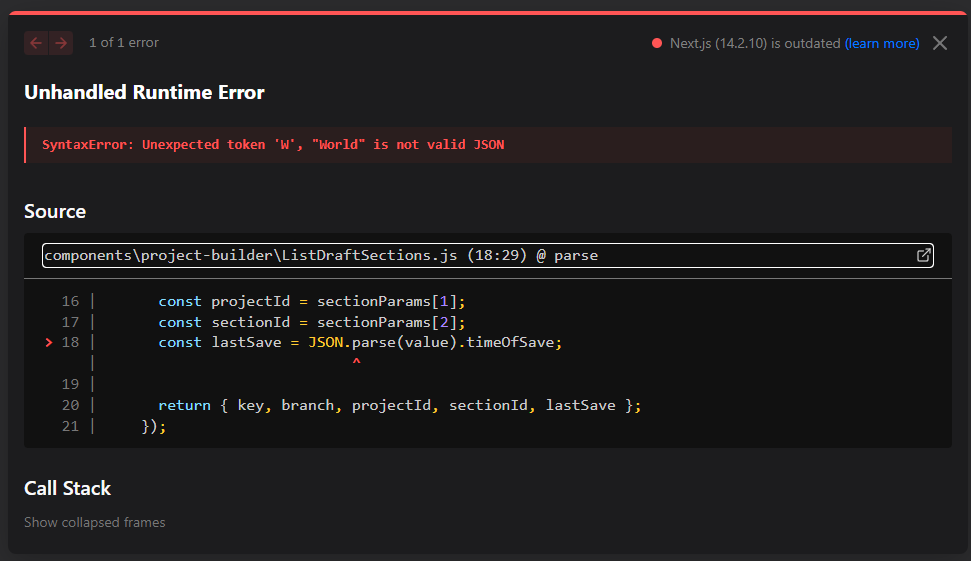
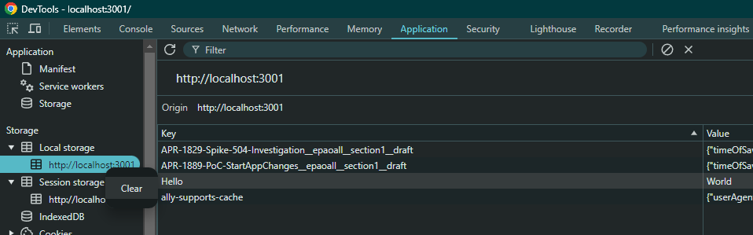

# Understanding das-qna-config

This is just a helper document intended to familiarise Fujitsu AOdP developers with the das-qna-config application. 

## React app vs Next.js app 

This application is built using [Next.js version 14](https://nextjs.org/docs/14/getting-started). 

- What's the difference between Next.js and React? 

React is a library for rendering and updating a webpages markdown from JavaScript, React in of itself is not a framework, React apps are usually combined with a framework. 

The chances are if you have worked on a React application before you have worked with the `create-react-app`, this framework (now deprecated as of React 19) provides a simple environment which runs a development server (when you run `npm run dev`) and provides utilities for compiling and bundling all your code together into a simple static file webpage (when you run `npm run build`), this then must be combined with an actual web server in order to host this web page (I.E. ASP.NET). 

Next.js however is a full-stack web framework with backend processing and even SSR, all built using the React library. Similar to `create-react-app` it provides a development server when you run `npm run dev`, but when you run `npm run build` instead of throwing out a static file webpage into the build directory, instead a fully fledged full-stack web application designed for NodeJS is generated and can be hosted with `npm run start`. 

## Running the application 

You will need the latest version of NodeJS and npm/yarn installed. There has been some issues getting these applications working on Fujitsu machines;

- If you are familiar with Linux, I have had success getting this project working on [WSL](https://learn.microsoft.com/en-us/windows/wsl/install)
    - Once when you are in WSL, if you have VSCode installed (recommended for React development), you may run `code .` in to open VSCode on the project
- I have had more success installing npm using the [msi installer](https://nodejs.org/en/download/prebuilt-installer)

### Setting the GH API token

The first thing this application does is retrieve data from the GitHub API, it thus needs a token that needs to be set in the environment variables. 

First, go to [Tokens (classic)](https://github.com/settings/tokens) in your GitHub User Profile -> Settings -> Developer Settings -> Personal access tokens, and click on Generate new token -> Generate new token (classic):

Give your token an appropriate name, I personally gave my tokens full access rights, this is probably not the best idea, and I was careful to delete the tokens once I was done with them. 

Hit generate token, you will be redirect back to the token settings page where the token will be at the top of the list, copy it (it wont be shown again when you navigate back to this page), and set it in your environment variables;

- On Windows (PowerShell) use: `$env:NEXT_PUBLIC_GITHUB_TOKEN='<git hub token here>'`
- On WSL/Linux use: `export NEXT_PUBLIC_GITHUB_TOKEN='<git hub token here>'`

### Installing the dependencies 

At the time of writing, this application depends upon several deprecated and unmaintained packages, as a result, there are a lot version conflicts, however, currently in the main branch all vulnerable packages have now been upgraded. 

Install the packages with either;

- `npm i --force` or 
- `yarn`

### Dependency issues 

In most projects we'd seriously like to avoid using a `--force` install, so if we do take this application further we shall need to:

- Upgrade all `@fortawesome` libraries 
    - `@fortawesome/fontawesome-svg-core`
    - `@fortawesome/free-solid-svg-icon`
    - `@fortawesome/react-fontawesome`
- Upgrade `react-select`
- Remove `react-html-parser`
    - Unmaintained for the past 7 years 
- Remove `react-sortable-hoc`
    - Library is no longer maintained as per the GH [repository](https://github.com/clauderic/react-sortable-hoc) 
- Remove `react-final-form`, `react-final-form-arrays`, `react-final-form-listeners`
    - Viewing the GitHub [organisation](https://github.com/orgs/final-form) shows this is unmaintained and unlikely ever going to support the current version of React. 
- Remove `react-json-view`
    - Formally deprecated as per the GH [repository](https://github.com/mac-s-g/react-json-view). 
- Remove `react-beautiful-dnd`
    - Formally deprecated as per the GH [repository](https://github.com/atlassian/react-beautiful-dnd). 
    - You will see this is already removed from this branch as it wasn't really used so was very easy to remove 

Many of these updates will need to be checked to make sure there is no breaking API or behaviour resultant from upgrading them, with many of the libraries that need removing, suitable replacements will need to be found and made to work with the codebase. 

### Starting the application 

To start the application run; 

- `npm run dev` or 
- `yarn dev`

This will then tell you which port it will be accessible from the browser from. 
- On WSL, `localhost` will not work, you will need to navigate to the `network` address of the WSL VM: 

### Troubleshooting 

- Loading the index page `Error: "Projects.getInitialProps()" should resolve to an object. But found "undefined" instead.` 
    - This is usually caused because Next.js errored when calling the GH API when loading the index page, make sure the [GH token env variable](#setting-the-gh-api-token) is set in the current terminal session your are running it from  

- Loading the index page `Unhandled Runtime Error` - inavlid JSON 
    - [ListDraftSections.js](https://github.com/SkillsFundingAgency/das-qna-config/blob/master/components/project-builder/ListDraftSections.js#L9) iterates over all items in local storage indiscriminately and tries to serialse them all to JSON, go to F12/dev tools -> Application -> Storage -> Local Storage, and delete all the items in local storage and reload 

